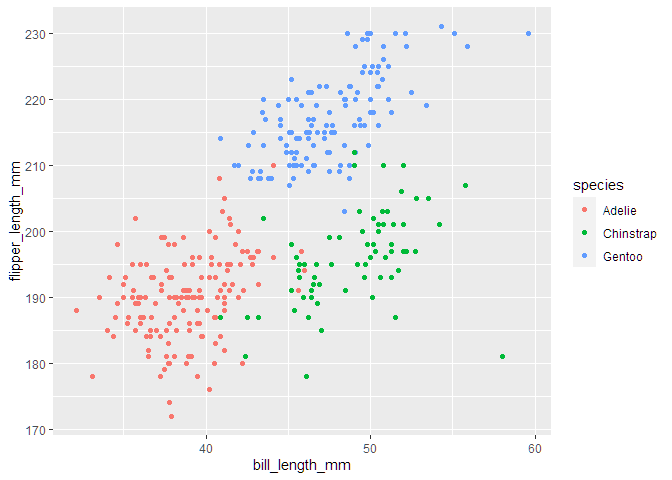

Homework 1
================
Tongtong Zhu
2022-09-23

``` r
library(tidyverse)
```

# Problem 1

``` r
data("penguins", package = "palmerpenguins")
```

``` r
mean_flipper_length = mean(pull(penguins, flipper_length_mm), na.rm = TRUE)
```

## Description of dataset

The `penguins` dataset has 344 observations of 8 variables. The eight
variables include species, island, bill_length_mm, bill_depth_mm,
flipper_length_mm, body_mass_g, sex and year.

It contains 344 rows and 8 columns. The mean flipper length is 200.92
mm.

## Scatterplot

``` r
ggplot(penguins, aes(x = bill_length_mm, y = flipper_length_mm, color = species)) + geom_point(na.rm = TRUE)
```

<!-- -->

``` r
ggsave("scatter_plot.pdf", height = 4, width = 6)
```

# Problem 2

## Data frame

``` r
new_df = tibble(
  vec_numeric = rnorm(10, mean = 0, sd = 1),
  vec_logical = vec_numeric > 0,
  vec_char = c("A","B","C","D","E","F","G","H","I","J"),
  vec_factor = factor(rep(c("small", "medicum", "large"), length = 10))
)
```

## Mean of each variable

``` r
mean_num = mean(pull(new_df, vec_numeric))
mean_logical = mean(pull(new_df, vec_logical))
mean_char = mean(pull(new_df, vec_char))
mean_factor = mean(pull(new_df, vec_factor))
```

The mean of `vec_numeric` variable is -0.99. The mean of
`vec_logical`variable is 0.2. The mean of `vec_char` variable is NA. The
mean of `vec_factor` variable is NA.

**Discussion**: The mean calculation works for numeric variable and
logical variable, but does not work for character variable and factor
variable.
